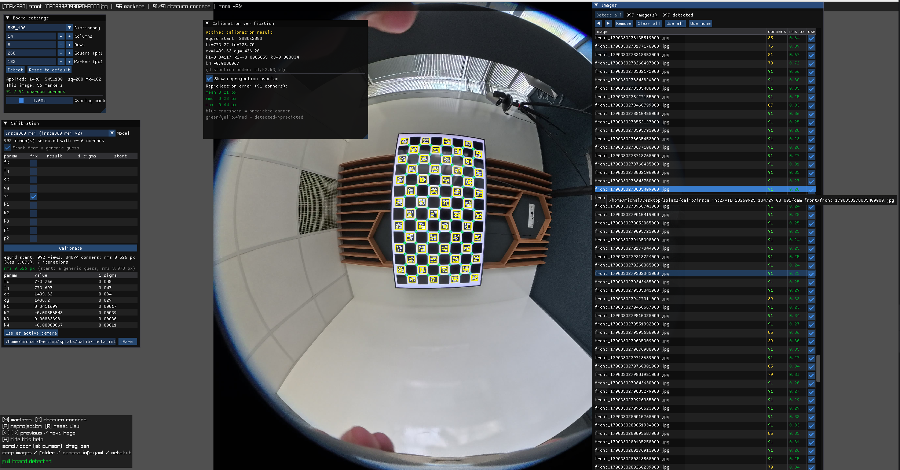

# insta-hdmapping

{ width=400px }
Tools for turning Insta360 dual-fisheye captures into calibrated, per-camera image
data for HD mapping.

| Folder | What it is |
| --- | --- |
| [`insta360-to-images`](insta360-to-images/) | C++17 tool: unpacks an Insta360 `.insv` capture into timestamped per-camera JPEG frames, IMU CSV, lens intrinsics, and an optional geometric equirectangular stitch. |
| [`insta360-test-calib`](insta360-test-calib/) | C++ GUI app (raylib/Dear ImGui) for calibrating the fisheye lenses (Mei model, Ceres) from captured ChArUco board images, and verifying a calibration against them. |
| [`cahruco`](cahruco/) | Python script that generates a pixel-exact ChArUco calibration board sized to fill a 4K screen, for use with `insta360-test-calib`. |

Each subproject has its own build instructions and README where applicable; see
`insta360-to-images/README.md` for the most detailed one.

## Build everything

A root `CMakeLists.txt` builds and installs both C++ subprojects in one shot,
provided their dependencies (OpenCV; yaml-cpp, Ceres 2.1+ and raylib 5.5 for
`insta360-test-calib`) are already installed:

```sh
cmake -S . -B build -DCMAKE_BUILD_TYPE=Release
cmake --build build -j
cmake --install build --prefix /usr/local
```

Pass `-DINSTA360_BUILD_TO_IMAGES=OFF` or `-DINSTA360_BUILD_TEST_CALIB=OFF` to
skip a subproject, e.g. if you don't have that one's dependencies installed.

## CI

Each subproject builds on Linux and macOS via GitHub Actions (`.github/workflows/`),
triggered only when its own files change. A separate `build-all` workflow
additionally exercises the root `CMakeLists.txt`, building and installing both
subprojects together, and runs whenever either subproject or the root
`CMakeLists.txt` changes.
